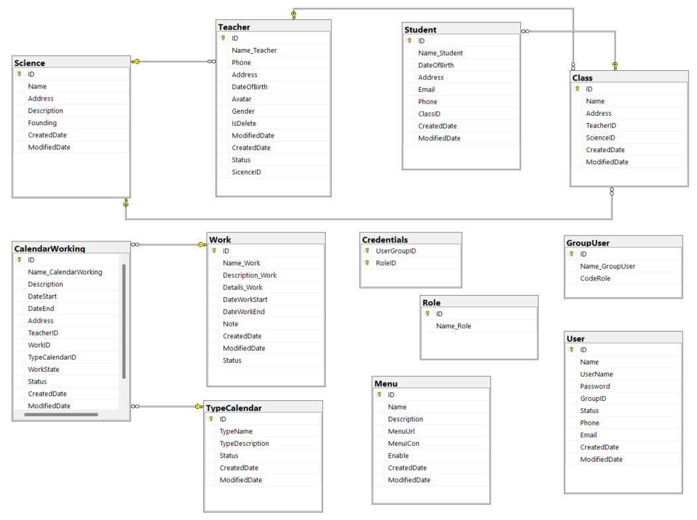
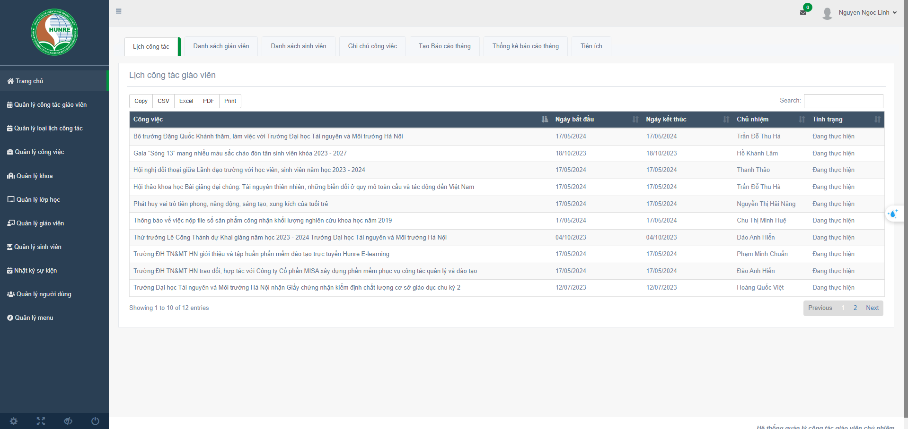

### GRADUATION PROJECT 🎓
**Software to support homeroom teachers' work**

### Description
**Main features of the system**

- The system provides important managers such as calendar lists, teacher lists, student lists, event notes, and other utilities, making it easy for users to access and manage information. 

- The work calendar list provides full basic information such as job name, location, start date, end date, teacher in charge, and implementation status, helping users have a clear and detailed view of work activities. 

- The list of teachers, students, classes, and faculties allows users to view basic information, making it faster and more efficient to look up and manage information.

### Technologies Used 
- Programming language: **C#**
- Database: **MySQL**
- Framework: **ASP.NET MVC**
- ORM tool: **Entity Framework**

### SQL Diagram

### Software interface
